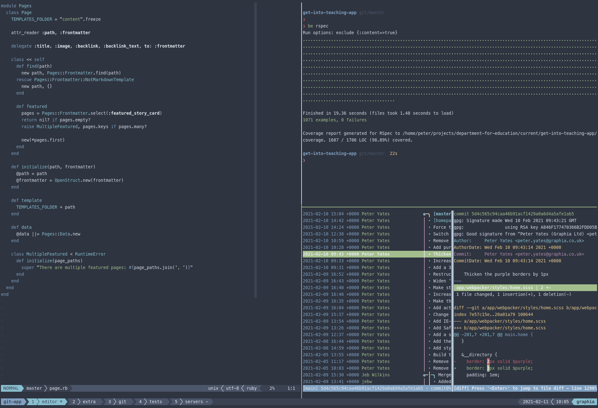

# My dotfiles

These are the configuration files for software I use frequently, including:

* [bat](https://github.com/sharkdp/bat)
* [fd](https://github.com/sharkdp/fd)
* [git](https://www.git-scm.com/)
* [kitty](https://sw.kovidgoyal.net/kitty/)
* [neovim](https://neovim.io/)
* [psql](https://www.postgresql.org)
* [tig](https://jonas.github.io/tig/)
* [tmux](https://github.com/tmux/tmux)
* [zsh](https://www.zsh.org/)

## Instructions

1. Install [stow](https://www.gnu.org/software/stow/),
   [make](https://www.gnu.org/software/make/) and
   [fd](https://github.com/sharkdp/fd).
2. Clone or download this repository and `cd` into the directory
3. Run `make up` to install and `make down` to uninstall

## Example

